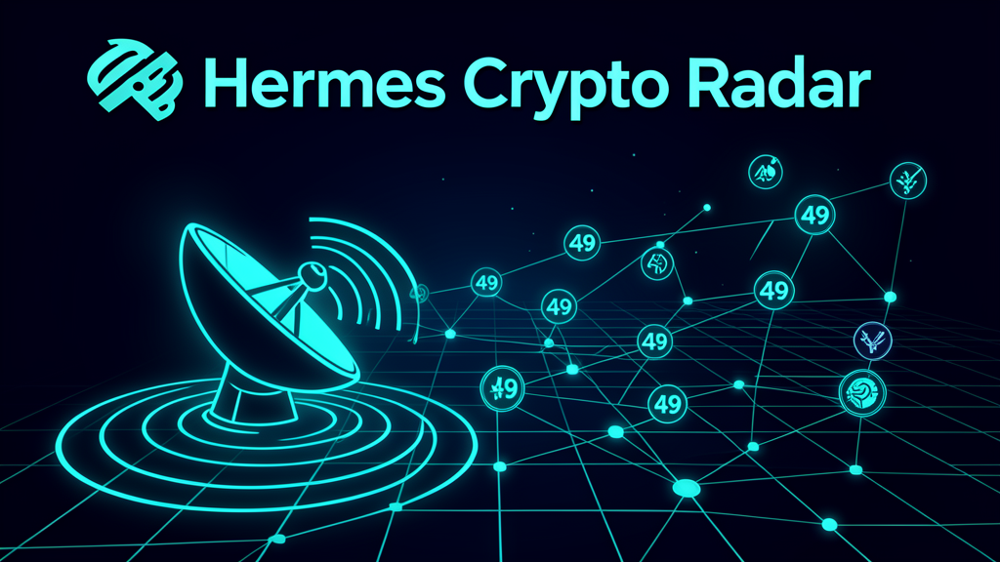
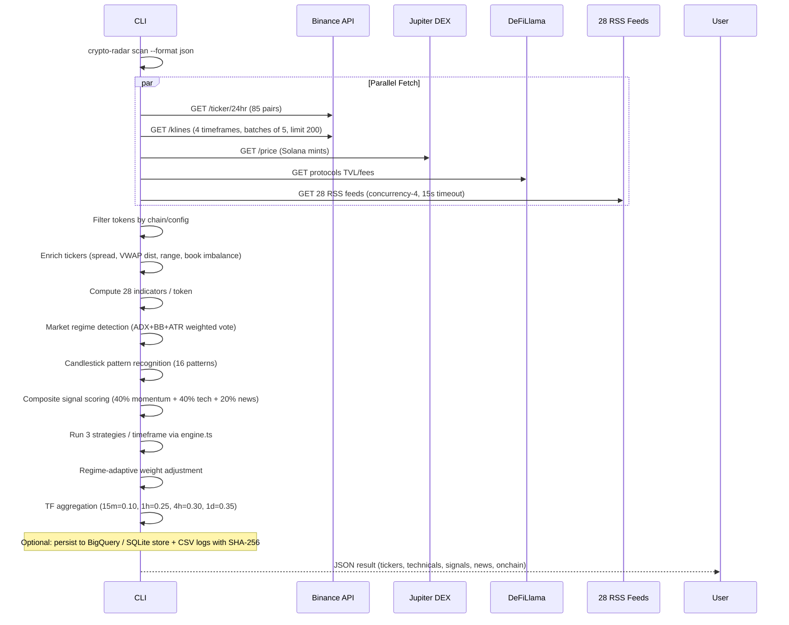
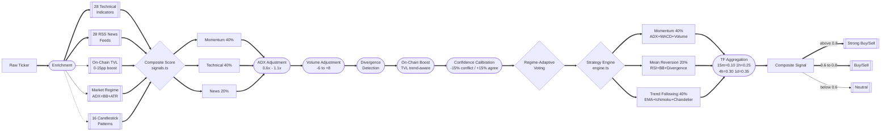
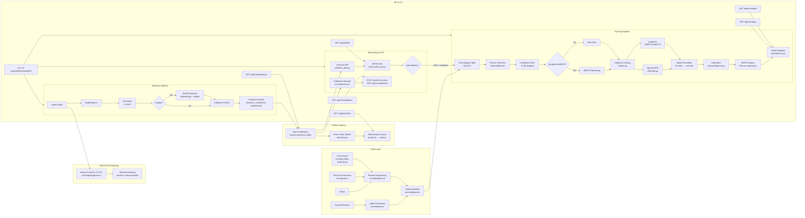

<p align="center">
  
</p>

<p align="center">
  <a href="https://github.com/ssdeanx/Hermes-Crypto-Radar/actions/workflows/ci.yml"></a>
  <a href="https://github.com/ssdeanx/Hermes-Crypto-Radar/actions/workflows/nightly-e2e.yml"></a>
  <a href="https://www.npmjs.com/package/crypto-radar"></a>
  <a href="https://www.npmjs.com/package/crypto-radar"></a>
  <br>
  <a href="https://github.com/ssdeanx/Hermes-Crypto-Radar"></a>
  <a href="LICENSE"></a>
  
  
  
  
</p>

<h1 align="center">🛰️ Crypto Radar</h1>
<p align="center"><strong>Enterprise-grade multi-chain crypto market intelligence — standalone CLI daemon</strong></p>
<p align="center"><strong>85 tokens across 35 chains with 28 technical indicators</strong> — 3-strategy signal engine, DeFiLlama on-chain metrics, Gemini AI reasoning, RSS news aggregation, SVG charts, CatBoost ML pipeline, Cloud Run deployment, BigQuery store, and a warm daemon for sub-50ms tool calls.</p>

<p align="center">
  <a href="#-features">Features</a> •
  <a href="#-quick-start">Quick Start</a> •
  <a href="#-why-crypto-radar">Why Crypto Radar?</a> •
  <a href="#-use-cases">Use Cases</a> •
  <a href="#-architecture--data-flow">Architecture</a> •
  <a href="#-cli-reference">CLI Reference</a> •
  <a href="#-developer-api">Developer API</a> •
  <a href="#-enterprise-features">Enterprise</a> •
  <a href="#-roadmap">Roadmap</a> •
  <a href="SPEC.md">SPEC</a> •
  <a href="CHANGELOG.md">Changelog</a>
</p>

---

## ✨ Features

| Area | Highlights |
|------|-----------|
| **🪙 Token Coverage** | **85 tokens** across **35 chains** — Solana, Polygon, Ethereum, BNB, Bitcoin, XRP, Cardano, Dogecoin, Cosmos, Sui, Aptos, Sei, Celestia, Injective, Thorchain, NEAR, TRON, Stellar, Avalanche, Litecoin, Bitcoin Cash, Hedera, Bittensor, Polkadot, Filecoin, Zcash, Monero, Algorand, Tezos, Theta, Dash, NEO, Internet Computer, Ethereum Classic + dynamic top-75 volume detection with synthesized TokenDef fallback |
| **📊 Technical Indicators** | **28 indicators**: RSI (14), MFI (14), MACD (12/26/9), Bollinger Bands (20/2), ATR (14), OBV, SMA, EMA, Stochastic (%K/%D), Ichimoku Cloud, Williams %R (14), CMF (20), TSI (25/13), ADX (14), Parabolic SAR, CCI (20), Keltner Channels (20/2), ROC (12), VWAP, Force Index (13), ADL, Chaikin Oscillator (3/10), StochRSI (14/14/3/3), TRIX (15), KST, Elder-Ray (13), Fisher Transform (10), Mass Index (14) |
| **🧠 Signal Engine** | 3 strategies: Momentum (40%), Mean Reversion (20%), Trend Following (40%) — ADX-adjusted weighted voting (±15pp), divergence detection (regular/hidden/subtle), 16 candlestick patterns, regime-adaptive weights (Trending 45/10/45, Ranging 15/60/25, Volatile 30/35/35), timeframe aggregation (15m=0.10, 1h=0.25, 4h=0.30, 1d=0.35), on-chain TVL boost (0–15pp), volume profile confirmation |
| **🧠 ML Pipeline** | **CatBoost direction classifier** — 80+ features, 28 TA indicators, forward-return labels, volatility-adjusted thresholds, SHAP feature attribution per prediction, ensemble voting (N models), automated feature selection, probability calibration, auto-retrain daemon, online learning layer (River), concept drift detection with auto-retrain trigger, model registry (MANIFEST.json) with production promotion gates |
| **🤖 Gemini AI Reasoning** | **Vertex AI Gemini 3.1 Pro** — generates professional market analysis and trading predictions using recent klines, prices, and technical signals. Stored in the `reasoning` field in the database. Integrated via `src/analysis/gemini.ts` |
| **⏱️ Multi-Timeframe** | Parallel kline fetch across 15m, 1h, 4h, 1d intervals with weighted aggregation (15m=0.10, 1h=0.25, 4h=0.30, 1d=0.35) |
| **⛓️ On-Chain Metrics** | DeFiLlama integration — protocol TVL, chain TVL, fees (1d/7d/30d) — boosts signal confidence 0–15% |
| **📰 News Aggregation** | 28 RSS feeds (CoinTelegraph, CoinDesk, Decrypt, The Block, Blockworks, SolanaFloor, DL News + 21 more) with relevance scoring, 4-tier source weighting, sentiment keyword analysis, recency bonus, `deduplicateMatches()` with 1h sliding window, `MIN_MATCH_RELEVANCE=0.5` poison-filtering, dedicated `crypto-radar-news.jsonl` output |
| **🎯 Dynamic Scan** | `--dynamic` flag auto-detects top N tokens by 24h volume (configurable, default: 75). Synthesizes `TokenDef` for non-registry high-volume tickers |
| **📈 Charts** | SVG candlestick, line, multi-panel dashboard with CSS gradients, tooltips, crosshairs, responsive viewBox, accessibility; ASCII sparklines |
| **💾 Export** | **JSONL** (ML-ready datasets), JSON, CSV, Markdown, terminal table, **XLSX** (Excel/Sheets with frozen headers + conditional formatting), **HTML/PDF** self-contained reports |
| **🥇 Daemon Mode** | Warm HTTP daemon for sub-50ms tool calls, configurable cache refresh, health checks, WebSocket push hub |
| **🗄️ BigQuery + SQLite Store** | Cloud BigQuery for production storage with automatic in-memory SQLite fallback when BigQuery is unavailable. Fully async refactored data layer |
| **☁️ Cloud Deployment** | **Google Cloud Run** + **Cloud Scheduler** for production: `deploy.sh` provisions Artifact Registry, Cloud Build, Cloud Run service, and hourly cron. Secure `POST /api/cron/scan` endpoint (OIDC / `x-cron-secret`). `Dockerfile` (node:22-bookworm-slim with uv Python) |
| **✅ Token Validation** | `tokens --validate` curls every registry token against live Binance USDT pairs — reports valid vs dead/delisted tokens |
| **🛡️ Enterprise** | Circuit breaker (CLOSED/OPEN/HALF-OPEN), token-bucket rate limiter, TTL cache, atomic writes, log rotation (10MB → gzip, 30-day retention), typed error classes, SHA-256 file checksums, `.dockerignore` reduces build context ~313MB → ~60MB |
| **⚙️ Configurable** | `radar.config.json` + `RADAR__*` env vars — strategy weights, timeframe weights, token whitelist, log level, data dir, cache TTL |
| **🐍 Python Type Checking** | `pyproject.toml` with mypy (strict) + ruff lint for Python ML code. Enforced via `npm run check:python` |
| **📡 REST API** | 30+ Fastify endpoints under `/api/*` — tickers, signals, klines, news, tokens, regime, futures, orderbook, portfolio, predictions, ML status, auth, cron scan |
| **🧪 Test Coverage** | **1222 tests across 55+ test files** — CLI layer, paper-trade CLI, collector, jupiter, support-resistance, and store at 90%+ lines. Overall lines 90.5%, statements 87.8%, functions 91.4%, branches 74.4% |

> **Requirements:** Node.js >= 22. No API keys required for core functionality (uses public Binance REST API + RSS feeds + DeFiLlama). Vertex AI Gemini requires GCP credentials.

---

## 🚀 Quick Start

```bash
# Install globally via npm
npm install -g crypto-radar

# Run your first scan
crypto-radar scan --filter SOL --no-news --format table
```

### Your first 60 seconds

```bash
# 1. Scan the Solana ecosystem
crypto-radar scan --chain solana --format table

# 2. Check composite signals
crypto-radar signals --filter BTC ETH SOL

# 3. Generate a candlestick chart
crypto-radar chart SOL --type candlestick --period 1h --width 800

# 4. Check system health
crypto-radar health

# 5. Validate token coverage against live Binance
crypto-radar tokens --validate
```

### Environment setup

```bash
# 1. Set the data directory (defaults to /data/crypto-radar/)
export RADAR__DATA_DIR=/data/crypto-radar

# 2. Create the directory if it doesn't exist
mkdir -p "$RADAR__DATA_DIR"

# 3. Set up ML environment (optional — for ML predictions)
npm run ml:setup

# 4. (Optional) For cron jobs, add env vars to your crontab:
#    RADAR__DATA_DIR=/data/crypto-radar
```

> ⚠️ **Important**: When running via cron, `RADAR__*` env vars must be set in the **cron environment** or the command line. Shell `export` alone does not propagate to cron tasks.

### Finding your data

After your first scan, all output files live in the configured data directory:

| File | Purpose | Format |
|------|---------|--------|
| `.../crypto-radar-log.csv` | Append-only scan log | CSV with SHA-256 checksums |
| `.../crypto-radar-news.csv` | Append-only news log | CSV |
| `.../crypto-radar-news.jsonl` | Structured news dataset | JSON Lines |
| `.../crypto-radar.db` | Persistent SQLite store | SQLite (node:sqlite, WAL mode) |
| `.../radar-output.txt` | Latest scan table | Plain text (human-readable) |
| `.../radar-output.csv` | Latest scan data | CSV |
| `.../radar-output.md` | Latest scan report | Markdown |
| `.../radar-output.xlsx` | Latest scan spreadsheet | Excel (frozen headers, conditional coloring) |
| `.../radar-runlog.jsonl` | Append-only run log | JSON Lines (ML-ready) |
| `.../radar-tickers.jsonl` | Append-only ticker data | JSON Lines |
| `.../archive/` | Monthly gzipped archives | `.gz` (rotated at month boundary) |

### Legacy path migration (if upgrading)

If you have existing data at `~/.hermes/data/crypto-radar/`, the tool auto-detects it as a secondary path during migration:

```bash
# Option A: Keep existing data in place (auto-detected)
# Just set RADAR__DATA_DIR to the new path; old data remains readable

# Option B: Migrate all data to the new path
cp -r ~/.hermes/data/crypto-radar/* "$RADAR__DATA_DIR"/
```

<p align="center">
  
  <br>
  <sub><em>Architecture overview — multi-source data pipeline from Binance, DeFiLlama, RSS feeds to outputs.</em></sub>
</p>

### Dynamic scan

```bash
# Auto-detect top 50 tokens by 24h volume
crypto-radar scan --dynamic --format table

# Top 20 with on-chain metrics
crypto-radar scan --dynamic 20 --onchain --format json
```

When `--dynamic` is used, the scan **auto-saves** all output formats (`.jsonl`, `.csv`, `.md`, `.xlsx`, `.txt`) to the configured data directory (`/data/crypto-radar/` by default, configurable via `RADAR__DATA_DIR`) — no `--format` needed for archiving. Data is persisted as **JSONL** (JSON Lines — one JSON object per line) for ML-ready streaming datasets. The `.txt` file always contains the human-readable table, making it ideal for cron delivery.

```bash
# Cron collector — auto-saves all formats, just declare the token count
crypto-radar scan --dynamic 39 --onchain
```

<details>
<summary><strong>📦 All installation methods</strong></summary>

### From npm

```bash
npm install -g crypto-radar
crypto-radar scan --filter SOL BTC --no-news
```

### One-liner (no npm/node preinstalled)

```bash
curl -fsSL https://raw.githubusercontent.com/ssdeanx/Hermes-Crypto-Radar/main/scripts/install.sh | bash
```

### From source

```bash
git clone https://github.com/ssdeanx/Hermes-Crypto-Radar.git
cd Hermes-Crypto-Radar
npm install && npm run build
```

### Docker

```bash
# Build from source
docker build -t crypto-radar .

# Or pull from Google Artifact Registry (if deployed)
# docker pull REGION-docker.pkg.dev/PROJECT/artifacts/crypto-radar
```

</details>

---

## 🎯 Why Crypto Radar?

| Feature | Crypto Radar | CoinGecko CLI | Binance CLI | CoinMarketCap API |
|---------|:------------:|:-------------:|:-----------:|:-----------------:|
| **Multi-chain coverage** | ✅ 35 chains | ✅ 100+ chains | ❌ Binance only | ✅ 400+ |
| **Technical indicators** | ✅ **28** built-in | ❌ None | ❌ None | ❌ None |
| **Composite signal engine** | ✅ 3 strategies | ❌ | ❌ | ❌ |
| **On-chain metrics** | ✅ DeFiLlama | ✅ Limited | ❌ | ✅ Limited |
| **News aggregation** | ✅ 28 RSS feeds | ❌ | ❌ | ✅ |
| **Gemini AI reasoning** | ✅ Vertex AI | ❌ | ❌ | ❌ |
| **BigQuery + SQLite store** | ✅ Dual-backend | ❌ | ❌ | ❌ |
| **Cloud Run deployment** | ✅ deploy.sh | ❌ | ❌ | ❌ |
| **SVG charts** | ✅ Candlestick, line, dashboard | ❌ | ❌ | ❌ |
| **XLSX/HTML/PDF export** | ✅ All formats | ❌ | ❌ | ✅ |
| **Daemon mode (<50ms)** | ✅ Warm cache | ❌ | ❌ | ❌ |
| **Free (no API key)** | ✅ | ✅ Limited | ✅ | ❌ API key required |
| **Enterprise infra** | ✅ Circuit breaker, rate limiter, log rotation | ❌ | ❌ | ❌ |
| **Market regime detection** | ✅ ADX+BB+ATR | ❌ | ❌ | ❌ |
| **Token validation** | ✅ Live Binance check | ❌ | ❌ | ❌ |

---

## 💡 Use Cases

### 📈 Trading Signals

Generate multi-timeframe composite signals with weighted strategy voting. Get buy/sell/neutral recommendations with confidence scores, on-chain TVL boosts, and news sentiment overlays.

```bash
crypto-radar signals --format table
crypto-radar scan --onchain --format json | jq '.signals[] | select(.compositeScore > 70)'
```

### 👁️ Market Monitoring

Run the warm daemon for continuous monitoring with sub-50ms tool calls. Set up Discord/Telegram webhooks for price alerts.

```bash
crypto-radar daemon --port 9877 --refresh 300
crypto-radar scan --dynamic 30 --no-news --no-log --quiet
```

### 📊 Portfolio Tracking

Track your portfolio tokens with enriched data, multi-timeframe trend analysis, and export-ready reports (CSV, XLSX, HTML).

```bash
crypto-radar scan --filter SOL BTC ETH ADA --format xlsx --onchain
crypto-radar scan --filter SOL --format html > report.html
```

### 🔬 Advanced Analysis

Leverage the correlation engine, backtesting framework, Volume Profile, and candlestick pattern recognition for deep market analysis.

```bash
crypto-radar backtest SOL --strategy momentum
crypto-radar chart SOL --type candlestick --period 1h
```

### ☁️ Cloud Production Deployment

Deploy to Google Cloud Run for managed hourly scanning with Gemini AI reasoning and BigQuery storage:

```bash
bash deploy.sh --project my-project --region us-central1
```

---

## 🏗 Architecture & Data Flow

### System Context Diagram

```mermaid
graph TB
    subgraph Radar["🛰️ Crypto Radar CLI"]
        C[CLI Entry<br/>dist/cli.js]
        C ==> D[Radar Engine<br/>src/radar.ts]

        D ==> E[Binance REST<br/>src/binance.ts]
        D ==> F[Jupiter DEX<br/>src/jupiter.ts]
        D --> G[DeFiLlama<br/>src/onchain.ts]
        D --> H[RSS News<br/>src/news.ts]
        D -.-> I[CoinGecko<br/>src/coingecko.ts]

        D ==> J[Strategy Engine<br/>src/analysis/]
        J --> K[Momentum 40%]
        J --> L[Mean Reversion 20%]
        J --> M[Trend Following 40%]

        D ==> N[28 Indicators<br/>src/indicators.ts]
        D --> O[Charts<br/>src/io/charts.ts]
        D ==> P[Daemon<br/>src/daemon.ts]
        D --> Q[WebSocket<br/>src/ws.ts]

        D ==> R{ML Pipeline<br/>src/ml/ + ml/}
        R ==> S[(CatBoost<br/>Classifier)]
        R ==> T[(River Online<br/>Learning)]
        R ==> U[(Drift<br/>Detection)]

        D ==> V[Gemini AI<br/>src/analysis/gemini.ts]
        D ==> W[BigQuery + SQLite<br/>src/store/db.ts]
    end

    subgraph External["🌐 External APIs"]
        E ==> X([Binance Exchange])
        F ==> Y([Jupiter Aggregator])
        G ==> Z([DeFiLlama])
        I ==> AA([CoinGecko])
        V ==> AB([Vertex AI Gemini])
    end

    subgraph Output["📦 Output"]
        D ==> AC[[JSONL / JSON / CSV<br/>XLSX / HTML]]
        D ==> AD[[BigQuery / SQLite Store]]
        D ==> AE[[SVG Charts]]
        D ==> AF[[Terminal]]
        D ==> AG[[WebSocket Push]]
        D ==> AH[[Discord / Telegram]]
    end
```



### Scan Pipeline — Data Flow



### Signal Pipeline — Composite Scoring



### ML Pipeline



### Project Structure

```
crypto-radar/
├── src/
│   ├── cli.ts              # CLI entry (Commander.js)
│   ├── index.ts            # Public API exports
│   ├── types.ts            # Type definitions (35 chains, 4 timeframes)
│   ├── tokens.ts           # Token registry (85 tokens, 35 chains)
│   ├── binance.ts          # Binance REST client (ticker + klines)
│   ├── coingecko.ts        # CoinGecko fallback price source
│   ├── indicators.ts       # 28 technical indicators
│   ├── onchain.ts          # DeFiLlama integration (TVL, fees, prices)
│   ├── news.ts             # RSS news fetcher + relevance matcher
│   ├── signals.ts          # Composite signal scoring + on-chain boost
│   ├── output.ts           # Formatters (table, JSONL, JSON, CSV, MD)
│   ├── xlsx-export.ts      # Excel export via exceljs
│   ├── html-report.ts      # HTML/PDF self-contained report generator
│   ├── radar.ts            # Main enrichment pipeline
│   ├── daemon.ts           # Warm daemon for sub-50ms tool calls
│   ├── ws.ts               # WebSocket real-time price streams
│   ├── webhook.ts          # Discord/Telegram alert delivery
│   ├── jupiter.ts          # Jupiter DEX price aggregator
│   ├── collector.ts        # Historical store backfill
│   ├── paper-trade.ts      # Paper trading portfolio simulation
│   ├── backtest.ts         # Strategy backtesting + weight optimization
│   ├── core/               # Enterprise infrastructure
│   │   ├── config.ts, errors.ts, cache.ts, rate-limiter.ts,
│   │   └── logger.ts, circuit-breaker.ts, log-rotation.ts
│   ├── analysis/           # Strategy signal engine
│   │   ├── strategies.ts, engine.ts, momentum.ts,
│   │   ├── mean-reversion.ts, trend-following.ts,
│   │   ├── support-resistance.ts, correlation.ts, regime.ts,
│   │   ├── volume-profile.ts, portfolio.ts, gemini.ts
│   │   └── trend-regression.ts
│   ├── store/              # BigQuery + SQLite persistent store
│   │   ├── db.ts, schema.ts
│   ├── sources/            # Extended data sources
│   │   ├── futures.ts, fear-greed.ts, orderbook.ts,
│   │   └── cross-asset.ts
│   ├── api/                # Fastify REST + WebSocket
│   │   ├── fastify/
│   │   │   ├── routes/
│   │   │   │   ├── rest.ts, cron.ts, ml.ts, auth.ts
│   │   │   └── server.ts
│   │   └── ws.ts           # WebSocket hub
│   ├── ml/                 # ML pipeline (TS orchestration)
│   │   ├── features.ts, labels.ts, dataset.ts, predict.ts,
│   │   ├── drift.ts, online.ts, monitor.ts
│   ├── io/                 # Visual output
│   │   ├── charts.ts, advanced-charts.ts, shared-svg.ts,
│   │   ├── patterns.ts, volume-profile.ts, signal-dashboard.ts
│   ├── math/               # Math hub (re-exports from simple-statistics, ml-matrix)
│   │   └── index.ts
│   └── monitor/            # System health + analytics
│       ├── health.ts
├── plugin/                 # Legacy Hermes plugin (BROKEN)
│   ├── __init__.py         # Hermes plugin Python bridge
│   └── plugin.yaml         # Plugin metadata
├── ml/                     # Machine learning (Python)
│   ├── train.py, predict.py, online.py, detect_drift.py,
│   ├── indicators.py, manifest.py, model.py, models/
│   └── pyproject.toml      # mypy strict + ruff lint
├── scripts/                # Automation scripts
│   ├── crypto-radar-collector.sh
│   ├── install.sh
│   ├── setup.sh
│   ├── setup-ml-env.sh
│   └── deploy.sh           # GCP Cloud Run deployment
├── .github/workflows/      # CI pipeline (Node 20 & 22)
├── Dockerfile              # node:22-bookworm-slim with uv Python
├── .dockerignore           # Reduces build context to ~60MB
├── docs/                   # Additional documentation
├── SPEC.md                 # Full specification
├── README.md               # This file
├── CHANGELOG.md            # Release history
└── package.json
```

---

## 📋 CLI Reference

| Command | Alias | Description | Key Flags |
|---------|-------|-------------|-----------|
| `scan` | `s` | **Full market scan** — prices, indicators, news, signals, on-chain | `--filter`, `--dynamic`, `--chain`, `--format`, `--sort`, `--onchain`, `--period`, `--no-tech`, `--no-news`, `--no-log`, `--quiet`, `--alt-source` |
| `signals` | — | **Composite signals snapshot** — lightweight score summary | `--filter`, `--format` |
| `news` | — | **Crypto news** — fetch and match against tracked tokens | `--filter`, `--format` |
| `tokens` | — | **List tracked tokens** — by chain filter. `--validate` checks registry against live Binance | `--chain`, `--validate` |
| `chart` | `c` | **Generate charts** — sparkline, moving average, SVG, candlestick, dashboard, watermark | `--type`, `--period`, `--lookback`, `--width` |
| `strategies` | `strat` | **List strategy modules** — names, weights, descriptions | — |
| `health` | — | **System health checks** — Binance API, data dir, uptime | — |
| `configure` | `config` | **Configuration** — show current or generate defaults | `--show`, `--generate` |
| `daemon` | — | **Warm daemon** — start/stop/status for sub-50ms tool calls | `--port`, `--refresh`, `--status`, `--stop` |
| `backtest` | — | **Strategy backtesting** — accuracy metrics, weight optimization | `--strategy`, `--period`, `--symbol` |
| `search` | — | **Token search** — find tokens by symbol/name/chain | `--query` |
| `report` | `r` | **Generate HTML/PDF report** | `--filter`, `--output` |
| `collect` | — | **Historical collector** — backfill klines + Binance Futures data into the SQLite store | `--klines`, `--futures`, `--backfill`, `--symbol`, `--orderbook`, `--fear-greed`, `--cross-asset` |
| `ml` | — | **ML pipeline** — train, predict, status, or drift detection | `train`, `predict`, `status`, `drift`, `--symbols`, `--horizon`, `--lookback`, `--interval`, `--model` (ADWIN/PageHinkley/KSWIN), `--delta`, `--records` |

### Data Store, REST API & Real-Time Push

Crypto Radar ships with a **BigQuery + SQLite dual store** (async refactored) that archives every scan and supports historical backfill. A **Fastify REST API** and **WebSocket push hub** are mounted into the daemon so external consumers can read live and historical data.

```bash
# Backfill all tracked tokens (klines + futures) into the store
crypto-radar collect --klines --futures

# Targeted backfill with custom depth
crypto-radar collect --symbol SOL BTC ETH --backfill 30

# Include order-book snapshots, Fear & Greed, and cross-asset dominance
crypto-radar collect --orderbook --fear-greed --cross-asset
```

**Architecture:**

- `src/store/db.ts` — Async `Store` class: uses Google Cloud BigQuery (`@google-cloud/bigquery`) with automatic fallback to in-memory SQLite (`node:sqlite`, WAL mode).
- `src/collector.ts` — `runCollector()` walks Binance `klines` backward to backfill, then incrementally updates from the last stored candle. Also pulls Binance Futures funding/OI/long-short/liquidations.
- `src/sources/` — `futures`, `fear-greed` (alternative.me), `orderbook`, `cross-asset` (CoinGecko global).
- `src/api/fastify/` — Fastify-only REST routing under `/api/*` (tickers, klines, signals, news, portfolio, futures, fear-greed, cross-asset, orderbook, stats, predictions, auth, ML endpoints, cron scan). Legacy `src/api/rest.ts` has been removed — Fastify is the sole API provider.
- `src/api/ws.ts` — WebSocket hub (`ws`) broadcasting `prices` / `signals` / `news` / `portfolio` channels on scan-complete.

### ML Pipeline (v2.3.0+)

Crypto Radar includes an **enterprise-grade machine learning pipeline** for price direction prediction using **CatBoost** (gradient boosting) with a **River** online learning layer. It collects 80+ features from the persistent store, trains tri-class direction classifiers (-1/0/1), runs predictions on every daemon refresh cycle, and automatically detects concept drift to trigger retraining.

**Prerequisites:**

```bash
# Set up Python ML environment (creates .venv-ml/ via uv)
npm run ml:setup
```

**Commands:**

```bash
# Check pipeline status (active model, store rows, predictions, drift events)
npm run ml:status
# or: node dist/cli.js ml status

# Train a model from historical store data (with feature selection + ensemble)
npm run ml:train
# or: node dist/cli.js ml train --symbols SOL BTC --horizon 5 --lookback 90

# Run prediction on latest data (with SHAP explanations)
npm run ml:predict
# or: node dist/cli.js ml predict --symbols SOL BTC --interval 1h

# Run concept drift detection on recent predictions
npm run ml:drift
# or: node dist/cli.js ml drift --model ADWIN --delta 0.002 --records 500
```

**Architecture:**

- `ml/train.py` — CatBoost training orchestrator with early stopping, class weighting, Optuna HPO, purgedcv walk-forward CV, BorderlineSMOTE balancing, SHAP analysis, ensemble voting, and feature selection. Exports to `ml/models/` with MANIFEST.json registry.
- `ml/predict.py` — Batch inference with optional `--explain` flag for SHAP per-prediction feature attribution. NaN fill via training-set median z-scores.
- `ml/online.py` — River concurrent logistic regression with AdaptiveStandardScaler. Incrementally updates between full CatBoost retrains (~µs per row). Built-in ADWIN drift detection on prediction error. Atomic save with version-stamped serialization.
- `ml/detect_drift.py` — Standalone drift detection (ADWIN/PageHinkley/KSWIN) on confidence values. Integrated into daemon cycle.
- `ml/indicators.py` — 28 pandas-ta technical indicators.
- `ml/manifest.py` — Model registry with production promotion gates (only promotes if F1 ≥ current best + 1%).
- `ml/model.py` — CatBoost model factory with GPU auto-detection, `model_size_reg`, `rsm` feature subsampling.
- `src/ml/` — TypeScript orchestration: feature engineering (80+ features), label generation (volatility-adjusted), dataset assembly, batch inference, drift detection wrapper, online model wrapper, calibration monitoring.
- `src/analysis/gemini.ts` — Vertex AI Gemini 3.1 Pro integration for market reasoning and trading predictions.
- `src/daemon.ts` — Auto-retrain (default: every 24h), prediction on every refresh, drift detection with auto-retrain trigger (1h cooldown).
- `ml/models/MANIFEST.json` — Central model registry tracking all trained models, their F1/accuracy, and production promotion status.
- `pyproject.toml` — mypy (strict) + ruff lint for Python ML code. Enforced via `npm run check:python`.

### Common Flags

| Flag | Type | Applies To | Description |
|------|------|-----------|-------------|
| `--filter <symbols...>` | `string[]` | scan, signals, news | Token symbols to include (e.g. `--filter SOL BTC`) |
| `--dynamic [count]` | `number` | scan | Auto-detect top N tokens by 24h volume (default: 75); triggers auto-save of all output formats to data dir |
| `--chain <chain>` | `string` | scan, tokens | Chain filter: `solana`, `polygon`, `bnb`, `ethereum`, etc. |
| `--format <fmt>` | `string` | scan | Output: `table` (default), `json`, `jsonl`, `csv`, `md`, `xlsx`, `html` |
| `--sort <mode>` | `string` | scan | Sort: `momentum` (default), `alpha`, `change`, `volume`, `signal` |
| `--onchain` | `boolean` | scan | Include DeFiLlama on-chain metrics (TVL, fees) |
| `--period <interval>` | `string` | scan | Kline interval: `15m`, `1h`, `4h`, `1d` (default: all) |
| `--no-tech` | `boolean` | scan | Skip technical indicator computation |
| `--no-news` | `boolean` | scan | Skip news fetching |
| `--no-log` | `boolean` | scan | Skip CSV file logging |
| `--quiet` | `boolean` | scan | Suppress table output (for scripting/cron) |
| `--alt-source` | `boolean` | scan | Use CoinGecko as alternate price source |

---

## 🔌 Legacy Hermes Plugin (BROKEN)

The Hermes plugin integration (`plugin/` directory, `plugin.yaml`) is **legacy and non-functional**. It was originally intended to register 8 tools into the Hermes Agent ecosystem:

| Tool | Description |
|------|-------------|
| `crypto_radar_scan` | Full market scan |
| `crypto_radar_signals` | Ranked composite trading signals |
| `crypto_radar_news` | Crypto news matching tracked tokens |
| `crypto_radar_tokens` | List all tracked tokens |
| `crypto_radar_chart` | SVG chart as agent visual response |
| `crypto_radar_daemon` | Warm daemon lifecycle management |
| `crypto_radar_onchain` | On-chain metrics |
| `crypto_radar_ws` | WebSocket stream management |

The Python bridge (`plugin/__init__.py`) spawns `node dist/cli.js` subprocesses and wraps output as Hermes tool responses. This path has **never been validated end-to-end**. All functionality works independently through the CLI and REST API — **do not rely on the Hermes plugin integration for production**. Use the production cron path, the CLI, or the REST API directly.

---

## 💻 Developer API

Use Crypto Radar programmatically in your own Node.js projects:

```typescript
import { scan, getSignals, getNews, getTokens, getChart } from 'crypto-radar';

// Full market scan
const result = await scan({
  filter: ['SOL', 'BTC', 'ETH'],
  noNews: false,
  onchain: true,
  format: 'json'
});
console.log(result.tickers);
console.log(result.signals);

// Composite signals only
const signals = await getSignals({ filter: ['SOL'] });
console.log(signals);

// Fetch news
const news = await getNews({ filter: ['BTC'] });
console.log(news);

// Generate SVG chart
const svg = await getChart({
  symbol: 'SOL',
  type: 'candlestick',
  period: '1h',
  width: 800
});

// List tracked tokens
const tokens = await getTokens({ chain: 'solana' });
```

```typescript
// Persistent store + collector + API (programmatic)
import {
  Store, runCollector,
  fetchFundingRates, fetchFearGreed, fetchGlobalData, snapshotOrderBook,
} from 'crypto-radar';

// Open (or create) the SQLite store
const store = Store.open(process.env.RADAR__DATA_DIR ?? '/data/crypto-radar');
store.migrate();

// Backfill historical klines + Binance Futures data
await runCollector({ klines: true, futures: true, backfillDays: 30 });

// Archive a scan into the store
const result = await scan({ format: 'json', store });
console.log(store.stats()); // row counts per table
```

```typescript
// TypeScript types included
import type { EnrichedTicker, TokenSignal, RadarOptions } from 'crypto-radar';
```

### Programmatic configuration

```typescript
import { configure } from 'crypto-radar/core/config.js';

configure({
  strategyWeights: { momentum: 0.5, meanReversion: 0.2, trendFollowing: 0.3 },
  cacheTtl: 60_000,
  logLevel: 'info'
});
```

---

## 📦 Output Formats

| Format | Command | Description |
|--------|---------|-------------|
| `jsonl` | `--format jsonl` | **JSON Lines** — one JSON object per line, ML-ready streaming format (default for `--dynamic`) |
| `json` | `--format json` | Structured JSON array for programmatic use |
| `csv` | `--format csv` | Spreadsheet-compatible rows |
| `md` | `--format md` | Markdown report |
| `table` | `--format table` | Terminal table (default for direct CLI use) |
| `xlsx` | `--format xlsx` | Excel workbook with frozen headers, auto-width, conditional coloring |
| `html` | `--format html` | Self-contained dark-theme HTML report with interactive tables |

---

## 🌐 Environment Variables

All environment variables use the `RADAR__` prefix. They override values from `radar.config.json` and built-in defaults.

| Env Variable | Default | Description | Section |
|-------------|---------|-------------|---------|
| `RADAR__DATA_DIR` | `/data/crypto-radar` | **Primary data directory** — all logs, reports, SQLite DB, and ML data persist here. Must be writable by the daemon user. | Core |
| `RADAR__SECONDARY_DATA_DIR` | auto-detected | **Legacy fallback path** — auto-detects `~/.hermes/data/crypto-radar/` if it exists | Core |
| `RADAR__LOG_LEVEL` | `info` | Log verbosity: `trace`, `debug`, `info`, `warn`, `error`, `fatal` | Core |
| `RADAR__LOG_RETENTION_DAYS` | `30` | Days to retain log archives before automatic pruning | Core |
| `RADAR__BINANCE_BASE_URL` | `https://data-api.binance.vision` | Override Binance REST API base URL | Core |
| `RADAR__FETCH_TIMEOUT_MS` | `10000` | HTTP fetch timeout in milliseconds | Core |
| `RADAR__CACHE_TTL_MS` | `300000` | In-memory cache TTL (default 5 minutes) | Core |
| `RADAR__TOKENS` | — | Token whitelist override — comma-separated symbols (e.g., `"SOL,BTC,ETH"`) | Tokens |
| `RADAR__STRATEGY_WEIGHTS` | — | JSON strategy weight overrides | Strategy |
| `RADAR__TIMEFRAME_WEIGHTS` | — | JSON timeframe weight overrides | Strategy |
| `RADAR__DAEMON_PORT` | `9877` | Daemon HTTP server port | Daemon |
| `RADAR__WS_PORT` | `9878` | WebSocket server port | Daemon |
| `RADAR__STORE_PATH` | `<dataDir>/crypto-radar.db` | SQLite store file path | Store |
| `RADAR__STORE_RETENTION_DAYS` | `30` | Data retention days in SQLite store | Store |
| `RADAR__API_TOKEN` | — | API token for gated endpoints (`POST /api/collect`) | API |
| `RADAR__JWT_SECRET` | — | JWT signing secret for auth API | Auth |
| `RADAR__JWT_AUDIENCE` | — | JWT audience claim | Auth |
| `RADAR__JWT_ISSUER` | — | JWT issuer claim | Auth |
| `RADAR__CRON_SECRET` | — | Secret for POST /api/cron/scan endpoint | API |
| `RADAR__WEBHOOK_URL` | — | Webhook URL for Discord/Telegram price alerts | Webhook |
| `RADAR__WEBHOOK_TYPE` | — | Webhook platform: `discord` or `telegram` | Webhook |
| `RADAR__DEFI_LLAMA_ENABLED` | `false` | Enable DeFiLlama on-chain metrics globally | Sources |
| `RADAR__SOURCES_FUTURES` | `true` | Enable Binance Futures data collection | Sources |
| `RADAR__SOURCES_FEAR_GREED` | `true` | Enable Fear & Greed index collection | Sources |
| `RADAR__SOURCES_CROSS_ASSET` | `true` | Enable cross-asset market data | Sources |
| `RADAR__SOURCES_ORDERBOOK` | `true` | Enable order-book snapshot collection | Sources |
| `RADAR__COINGLASS_KEY` | — | CoinGlass API key (optional, for enhanced futures data) | Sources |
| `RADAR__ML_ENABLED` | `false` | Enable ML prediction pipeline (requires Python + CatBoost) | ML |
| `RADAR__ML_PYTHON` | `python3` | Python interpreter path for ML subprocesses | ML |
| `RADAR__ML_MODEL_DIR` | `<dataDir>/ml/models` | Directory for trained model storage | ML |
| `RADAR__ML_DATA_DIR` | `<dataDir>/ml/data` | Directory for ML training datasets | ML |
| `RADAR__ML_LOOKBACK_DAYS` | `90` | Days of historical klines for model training | ML |
| `RADAR__ML_RETRAIN_HOURS` | `24` | Auto-retrain interval in hours (daemon refresh cycle) | ML |
| `RADAR__ML_MIN_CONFIDENCE` | `0.6` | Minimum confidence threshold for ML predictions | ML |
| `RADAR__ML_LABEL_HORIZON` | `5` | Forward-return label horizon (1, 5, 20, or 60 candles) | ML |
| `RADAR__ML_OPTUNA_TRIALS` | `30` | Number of Optuna hyperparameter search trials | ML |
| `RADAR__ML_OPTIMIZE` | `false` | Enable hyperparameter optimization during training | ML |
| `RADAR__ML_CV_FOLDS` | `3` | Cross-validation folds for training evaluation | ML |
| `RADAR__ML_BALANCE` | `false` | Enable class balancing (BorderlineSMOTE) | ML |
| `RADAR__ML_SHAP` | `false` | Enable SHAP feature attribution per prediction | ML |
| `RADAR__ML_USE_TA` | `true` | Enable pandas-ta technical indicator feature engineering | ML |

> **Important for cron users:** All `RADAR__*` env vars must be set in the cron environment or command line. Shell-level `export` in `~/.bashrc` does **not** propagate to cron tasks.

---

## 📊 Benchmarks

| Metric | Value |
|--------|-------|
| **Scan time** (85 tokens, full indicators + news) | ~8–12s |
| **Scan time** (85 tokens, cached indicators) | ~3–5s |
| **Daemon response time** (warm cache) | <50ms |
| **Parallel kline fetching** (4 timeframes, 85 tokens) | ~60% reduction vs sequential |
| **News aggregation** (28 feeds, concurrency-4) | ~2s vs ~12s sequential |
| **Test coverage** | 1222+ tests |
| **Indicator fuzz tests** | 157 edge-case tests (NaN, Infinity, empty) |
| **Supported token pairs** | 85 (Binance USDT) |

---

## 🏢 Enterprise Features

Crypto Radar ships with production-grade enterprise infrastructure:

| Feature | Description |
|---------|-------------|
| **🔁 Circuit Breaker** | CLOSED/OPEN/HALF-OPEN with configurable failure threshold and cached-fallback |
| **⏱️ Rate Limiter** | Token-bucket algorithm — configurable max requests per time window |
| **🗃️ TTL Cache** | In-memory cache with auto-expiry, stats tracking, memoize support |
| **📝 Log Rotation** | 10MB rotate → gzip compress → keep 5 archives → monthly archive of all data files via `archive/` subdirectory → 30-day data retention policy |
| **🔐 Atomic Writes** | `.tmp` → `fs.renameSync()` — zero partial-write data loss |
| **✅ Typed Errors** | 6 error classes: `CryptoRadarError`, `NetworkError`, `RateLimitError`, `DataError`, `ConfigError`, `DaemonError` |
| **📐 Config System** | JSON config file + `RADAR__*` env vars with typed defaults and schema validation |
| **🔍 Health Checks** | Binance API status, data directory integrity, system resources, uptime tracking |
| **🔏 SHA-256 Checksums** | File integrity verification for log archives and exports |
| **🔄 Data Retention** | Configurable pruning by age with checksum verification; monthly archive rotation for all data files |
| **📁 Persistence Audit** | All 21 write sites documented — 13 `config.dataDir`-bound, CWD-escape hardened in v2.4.0 |
| **🏭 Production Ready** | Documented cron env propagation, production deployment steps, secondary data dir for migration |
| **☁️ Cloud Run Ready** | `Dockerfile` (node:22-bookworm-slim) + `deploy.sh` for GCP provisioning — Artifact Registry, Cloud Build, Cloud Run, Cloud Scheduler cron |
| **🗄️ BigQuery Store** | Google Cloud BigQuery with automatic in-memory SQLite fallback |
| **🐍 Python Quality** | `pyproject.toml`: mypy strict + ruff lint, enforced via `npm run check:python` |
| **🐳 Docker Optimized** | `.dockerignore` reduces build context ~313MB → ~60MB |
| **🤖 Gemini AI Reasoning** | Vertex AI Gemini 3.1 Pro generates professional market analysis for ML predictions |

---

## 🗺 Roadmap

| Feature | Status | Target |
|---------|--------|--------|
| **Cloud Run + Cloud Scheduler deployment** | ✅ **v2.6.0** | Released |
| **Vertex AI Gemini 3.1 Pro reasoning** | ✅ **v2.6.0** | Released |
| **BigQuery + SQLite async store** | ✅ **v2.6.0** | Released |
| **85-token coverage (17 new tokens)** | ✅ **v2.6.0** | Released |
| **`tokens --validate` command** | ✅ **v2.6.0** | Released |
| **Python type checking (mypy + ruff)** | ✅ **v2.6.0** | Released |
| **Dockerfile + .dockerignore optimization** | ✅ **v2.6.0** | Released |
| **CatBoost ML pipeline (v2.3.0)** | ✅ Released | v2.3.0 |
| **Concept drift + River online learning** | ✅ Released | v2.3.0 |
| **Enterprise Fastify API (v2.2.0)** | ✅ Released | v2.2.0 |
| **Multi-user watchlists** (shared token lists via config) | 🔜 | TBD |
| **AI-driven signal suggestions** (LLM-powered trade ideas) | 🔜 | TBD |
| **Custom indicator scripting** (user-defined indicators in TS) | 🔜 | TBD |
| **Backtesting dashboard** (web UI for strategy optimization) | 🔜 | TBD |
| **Real-time alert engine** (price thresholds, indicator crossovers) | 🔜 | TBD |
| **DEX aggregation** (Uniswap, Raydium, Orca, Jupiter) | 🔜 | TBD |
| **Social sentiment analysis** (X/Twitter, Reddit, Discord) | 🔜 | TBD |

---

## 👥 Contributors

<a href="https://github.com/ssdeanx"></a>

- **Sam** — Creator & maintainer ([@ssdeanx](https://github.com/ssdeanx))
- Contributions welcome! See [CONTRIBUTING.md](CONTRIBUTING.md) (coming soon) or open a [PR](https://github.com/ssdeanx/Hermes-Crypto-Radar/pulls).

---

## 🛠 Development

```bash
npm run build        # TypeScript compile → dist/
npm run watch        # Watch mode for development
npm run start        # Run CLI (default: scan)
npm test             # Run vitest suite (1222+ tests)
npm run test:watch   # Watch mode for TDD
npm run test:coverage # Test coverage report
npm run lint         # ESLint check
npm run lint:fix     # ESLint auto-fix
npm run format       # Prettier check
npm run format:fix   # Prettier auto-format
npm run clean        # rm -rf dist/
npm run daemon       # Start warm daemon
npm run daemon:status # Check daemon status
npm run benchmark    # Run performance benchmarks
npm run backtest     # Run strategy backtesting
npm run docs         # Generate TypeDoc API reference
npm run check:python # Python mypy (strict) + ruff lint
```

### Project Scripts

```bash
# Comprehensive scan by chain
node dist/cli.js scan --chain solana --format json

# Export to Excel
node dist/cli.js scan --filter SOL BTC ETH --format xlsx --no-news

# Signals view (lightweight)
node dist/cli.js signals --filter SOL

# Token chart (candlestick with EMA overlays)
node dist/cli.js chart SOL --type candlestick --period 1h --width 800

# System health
node dist/cli.js health

# Dynamic top-75 scan with on-chain metrics
node dist/cli.js scan --dynamic --onchain --format table

# Generate HTML report
node dist/cli.js report --filter SOL BTC --output report.html

# Start the warm daemon
node dist/cli.js daemon --port 9877 --refresh 300

# Strategy backtesting
node dist/cli.js backtest SOL --strategy momentum --period 30d

# Validate token registry against live Binance
node dist/cli.js tokens --validate
```

---

## 📚 Documentation

- **[SPEC.md](SPEC.md)** — Full project specification with architecture, token roster, data flow, scoring models, development guide, data persistence architecture, production deployment, and publishing plan
- **[CHANGELOG.md](CHANGELOG.md)** — Full release history from v1.0.0 to v2.6.0
- **[CRYPTO-ENTERPRISE-AUDIT.md](CRYPTO-ENTERPRISE-AUDIT.md)** — Enterprise-grade audit covering security, reliability, performance, and code quality
- **[docs/api/](docs/api/)** — Auto-generated TypeDoc API reference

---

## 📄 License

MIT © Sam

---

## 🔒 Security

See [SECURITY.md](SECURITY.md) for our security policy, vulnerability disclosure process, and architecture overview.

### Security Headers

The warm daemon HTTP endpoints include the following security headers to protect against common web vulnerabilities:

| Header | Value |
|--------|-------|
| `X-Content-Type-Options` | `nosniff` |
| `X-Frame-Options` | `DENY` |
| `Strict-Transport-Security` | `max-age=31536000` |
| `Content-Security-Policy` | `default-src 'none'; frame-ancestors 'none'` |
| `Referrer-Policy` | `no-referrer` |
| `Cache-Control` | `no-store` |

### Zero API Key Design

Crypto Radar uses **public APIs** for core functionality — no API keys, tokens, or credentials are required. All core data sources (Binance public API, CoinGecko free tier, DeFiLlama, RSS feeds) are freely accessible. Vertex AI Gemini requires GCP credentials only when using cloud reasoning features.

### Supply Chain Security

- `npm audit` runs as part of CI to detect dependency vulnerabilities
- npm overrides for transitive vulnerability fixes (see `package.json`)
- Regular dependency updates tracked in [CHANGELOG.md](CHANGELOG.md)

---

<p align="center">
  <strong>🛰️ Crypto Radar</strong> — Production-grade multi-chain crypto market intelligence.
  <br><br>
  <a href="https://github.com/ssdeanx/Hermes-Crypto-Radar"></a>
  &nbsp;
  <a href="https://www.npmjs.com/package/crypto-radar"></a>
  &nbsp;
  <a href="https://github.com/ssdeanx/Hermes-Crypto-Radar/issues"></a>
  &nbsp;
  <a href="https://github.com/ssdeanx/Hermes-Crypto-Radar/pulls"></a>
  <br><br>
  <sub>Made with ❤️ by <a href="https://github.com/ssdeanx">Sam</a> — Built for traders, by traders. MIT licensed.</sub>
  <br>
  <sub>⭐ Star us on GitHub — every star helps us prioritize features and fix issues faster.</sub>
</p>
